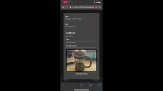

# NZMSA 2021 - Frontend - Hows Your Day app

## Introduction

Send timeline styled daily updates to your friends and families

## Demo
Youtube demo:

[](https://youtu.be/ADWoIjL8SDE) 👈 

<a href="http://nzmsa-react-2021.azurewebsites.net" target="_blank">Live App</a> 👈 

- Camera API does not work for Google Chrome

- Backend SQL database will need few minutes to start up on first login. Retry after 1-2 minutes

## Initial Figma mockup 


## Created using:

Frontend:

- React
- Redux
- Apollo Client

Backend:

- ASP.NET
- Hot Chocolate GraphQL for .NET
- Azure Storage Blob, Azure KeyVault

[Backend repository](https://github.com/jloo87/NZMSA_Phase2_Backend)

UI:

- Material UI
- Storybook


## Storybook

Clone repository

```
git clone https://github.com/jloo87/NZMSA-Phase2.git
```

Install dependencies

```
npm install
```

Start storybook


```
npm run storybook
```


Open on browser with URL: [http://localhost:6006/](http://localhost:6006/)
